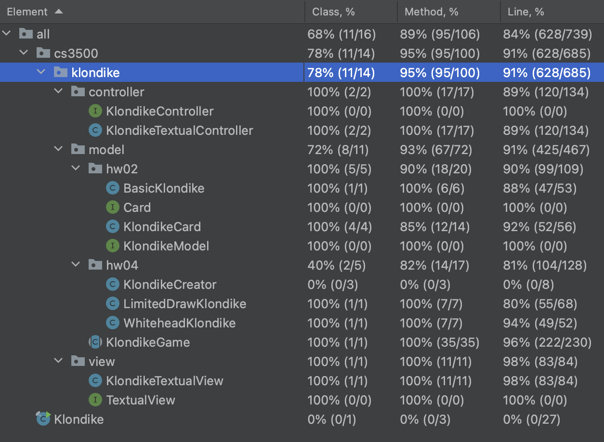

# Solitaire Game

## Summary

This is a Java implementation of a game of Solitaire. To play the game, the user would first enter the desired 
game mode into the command line. There are three different selections of gameplay: Basic Klondike, Limited Draw
Klondike, and Whitehead Klondike. The rules of each of the games are as follows:

| Basic                                            | Limited Draw                          | Whitehead                                        |
|--------------------------------------------------|---------------------------------------|--------------------------------------------------|
| Follows the default rules of a game of solitaire | Limited (specified) amount of redraws | New cascades must be with non-alternating colors |
|                                                  |                                       | Can put a non-King card on an empty pile         |

The command line then takes the optional arguments of specifying the number of piles and number of draw cards (visible at a time).
If the user does not specify those parameters, the defaults are 7 piles and 3 draw cards.

## Project Structure

The unique package structure corresponds to my assignment requirements for the auto-grader.

### cs3500.klondike.controller
In the controller package, there is the interface KlondikeController and the class KlondikeTextualController. 
Although the KlondikeController interface only has one class implementing it, it honors the open/closed principle
in the SOLID principles. If another controller were needed for a non-textual UI, then the interface would allow 
for a seamless addition. 

### cs3500.klondike.model
The KlondikeModel interface is implemented by the KlondikeGame abstract class. This abstract class is extended by
the game mode classes BasicKlondike, LimitedDrawKlondike, and WhiteheadKlondike. The factory pattern is used in the
KlondikeCreator class (for the main method). The model interface outlines all the necessary methods needed for a game
of Klondike Solitaire. The Card interface is implemented by the KlondikeCard class. It represents a regular card in a
real life deck.

### cs3500.klondike.view
The TextualView is implemented by the KlondikeTextualView class. It is used to render the "board" while playing.

## Tests
The tests labeled Examplar were for finding "chaffs" or edge cases in possible implementations of the controller or the model.
I was able to get 91% test line coverage in the cs3500.klondike package.

## Design

In this project, I used the MVC (Model-View-Controller) framework. I also used other concepts learned in my object-oriented
design class such as the factory pattern and abstraction. 

## Improvements

- Creating a cohesive README file
- More to come...

## Future Plans

- Abstract out repetitive code
- Incorporate the command pattern into the controller
- Make the code more readable

## Reflections/Thoughts
Even though I made this program last semester, I feel like I have improved so much as a programmer. When I was
implementing these assignments, I believed it was the hardest spec someone could assign. This is why I think it 
would be a great exercise to improve this code and put my new skills to the test.

## Changes made to improve my code over the duration of the assignment:
BasicKlondike
- Deleted everything keeping track of the drawPile visibility
- Kept track of visibility within the model (not the card class)
- Kept track of drawPile by using a discardPile as well (for better abstraction)
- Wrote JavaDoc

KlondikeCard
- Improved JavaDoc

KlondikeTextualController
- Explained why I did nothing with the NumberFormatException
- Made playGame under 50 lines long
- Made System.lineSeparator() only appear once# SolitaireGame
